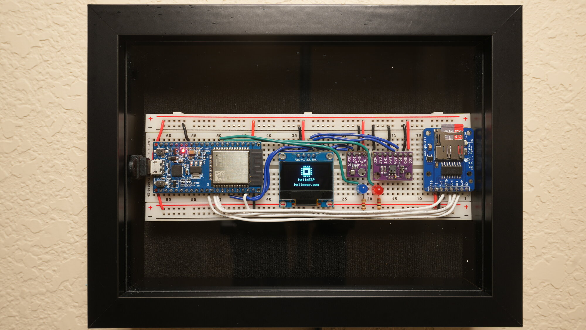

# HelloESP

[](https://helloesp.com)
[](https://opensource.org/license/mit/)
[](https://github.com/Tech1k/helloesp/actions/workflows/build.yml)
[](https://platformio.org/)

A public website running entirely on a single ESP32 with 520 KB of RAM. Every page, every sensor reading, every guestbook entry is served by the microcontroller itself. There is no backend server.

**Live at [helloesp.com](https://helloesp.com)**



---

## Why?

Because it's fun to see how far a $10 microcontroller can go. The last version ran until 2023 on an ESP32 behind a Cloudflare tunnel. It eventually went offline and the domain lapsed.

Years later I came back to it. The internet had gotten heavier in the meantime: more of everything, most of it wasteful. This whole website weighs less than a single phone wallpaper. I wanted to see what a single small chip could still do against all that. The domain was available again, which felt like permission.

This time it stays up. If it goes down, I fix it. That's the point now.

## How it works

The ESP32 holds a persistent outbound WebSocket to a Cloudflare Worker. When a browser hits `helloesp.com`, the Worker relays the request over that socket and streams the response back. The ESP never accepts an inbound TCP connection from the internet, only from the LAN.

```
 Browser ──HTTPS──▶ Cloudflare Worker ──WSS──▶ ESP32 (on your home network)
                         ▲                        │
                         └────── response ────────┘
```

Responses larger than a single WebSocket frame are chunked and base64-encoded. Admin endpoints return 404 through the relay and are only reachable on the LAN. A second shared secret (HMAC) can be enabled so a leaked Worker secret alone cannot impersonate the device.

The same WebSocket also carries **live push events** the other direction: every 5 seconds the device pushes sensor stats, and every tracked public request triggers a console event. The Worker fans these out to connected browsers via Server-Sent Events (`/_stream`), so the homepage ticks in real time without polling.

Without the Worker, the site still runs on LAN via mDNS at `http://helloesp.local`.

## Hardware

| Part | Role |
|---|---|
| ESP32 DOIT DevKit V1 | MCU, 520 KB RAM, dual-core Xtensa |
| BME280 | Temperature, humidity, barometric pressure |
| CCS811 | CO₂, VOC |
| SSD1306 128×64 | OLED, rotating info pages with burn-in shift |
| Micro SD card (FAT32, ≤32 GB) | Filesystem: HTML, images, logs, config |
| Status LED | Blinks on every public visit |
| Notification LED | Lights when the guestbook has pending entries |

### Wiring

| Signal | ESP32 Pin |
|---|---|
| I²C SDA (BME280, CCS811, OLED) | GPIO 21 |
| I²C SCL (BME280, CCS811, OLED) | GPIO 22 |
| SD CS | GPIO 5 |
| SD MOSI | GPIO 23 |
| SD MISO | GPIO 19 |
| SD SCK | GPIO 18 |
| Status LED | GPIO 33 |
| Notification LED | GPIO 32 |
| CCS811 WAKE | GND |

I²C addresses: BME280 `0x76`, CCS811 `0x5A`, SSD1306 `0x3C`.

## Features

**Frontend**
- Live dashboard: 12 sensor/system metrics, trend arrows, degraded-sensor indicators
- Real-time SSE updates (push every 5s from the device), with graceful fallback to 30s polling
- Live connection indicator (pulsing green dot) and a "Right now" request ticker on the homepage
- Historical CSV charts with day/week/month switcher; weekly/monthly/yearly aggregate archives
- Hall of Fame (lifetime extremes: peak CO₂, temp range, busiest day, longest uptime) and year-over-year monthly visitor deltas on `/history`
- Visitor country map, request-rate chart, changelog, photo carousel
- `/console` live feed: last 50 public requests with country flags, updated instantly via SSE
- Outdoor weather context (via Cloudflare Worker proxy to Open-Meteo)
- Guestbook with submission, moderation queue, rate limiting
- Dark mode, responsive, SRI-pinned CDN scripts, no tracking

**Firmware**
- Full async HTTP server over WebSocket-relayed traffic
- Non-blocking WebSocket client with exponential backoff (5 s → 300 s cap)
- Atomic writes for all critical files (`tmp → bak → rename`)
- Period aggregation: weekly, monthly, yearly checkpoints
- CSV sensor logging every 5 minutes
- NTP with three-server failover and bounded boot retry
- WiFi runtime watchdog: reboots if disconnected >10 min
- Heap safety net: reboots at <20 KB free rather than hang
- Event-driven SSE push for sensor stats (5s) and console entries (on each request)
- Admin panel (LAN-only): OTA updates, file manager, full SD backup/restore, R2 backup health + liveness test, SMTP2GO test email, self-test, sensor + error log viewers, device health sparklines (heap + RSSI), Worker link status, data management (reset counters / export state), maintenance mode toggle
- OLED boot sequence, rotating runtime pages, burn-in protection

**Edge**
- Cloudflare Worker (Durable Object) with per-IP rate limiting, 8 KB POST cap
- SSE fanout hub: multiple browser viewers, constant ESP load
- Maintenance mode with auto-expiring window and dedicated 503 page
- Auto-retry + pulsing indicator on all error pages (offline / timeout / maintenance)
- Hourly outdoor-weather refresh cached in the Durable Object
- Embeddable live status badges at `/status.svg` (and `/status-wide.svg`)
- Optional HMAC challenge-response device auth
- Optional SMTP2GO integration for guestbook-pending alerts, dead-man's-switch (device silent >N hours), backup failures, and overdue-backup warnings
- Optional daily off-site backups to Cloudflare R2 with GFS rotation (7 daily + 4 weekly + 12 monthly + yearly) and sha256 integrity manifests
- Security headers, no-cache list for dynamic endpoints
- RSS feeds (`/changelog.rss`, `/guestbook.rss`), `sitemap.xml`, `robots.txt`, `.well-known/security.txt`

### Embeddable status badges

Four variants of the compact badge (shields-compatible, edge-cached 60s):

```markdown
                    # default: uptime
      # visit count
        # current temperature
      # online/offline pulse
```

Plus a wide stat card with multiple live metrics:

```markdown

```

Both pull from the Worker's cached sensor state. Zero ESP load regardless of how many pages embed them. State-aware colors (live, stale, offline, maintenance).

## Setup

### 1. Firmware

```bash
git clone https://github.com/Tech1k/helloesp.git
cd helloesp
pio run -t upload
```

Requires [PlatformIO](https://platformio.org/).

### 2. SD card

Format a FAT32 SD card (≤32 GB) and copy the contents of `data/` to the root. The `data/` folder is **not** flashed. It lives on the SD card.

### 3. Config

Rename `config.example.txt` to `config.txt` on the SD card and fill in:

```
wifi_ssid=YOUR_SSID
wifi_pass=YOUR_PASSWORD
admin_user=admin
admin_pass=your-admin-password
timezone=MST7MDT,M3.2.0,M11.1.0
```

Timezone is a POSIX TZ string. Common US examples are listed in the file. Leave `worker_url`, `worker_key`, and `device_key` blank to run LAN-only.

### 4. Cloudflare Worker (optional, for public access)

```bash
# Generate a shared secret; don't pick one by hand
openssl rand -hex 32
```

The same value goes in two places:
- `worker_key` in the SD `config.txt`
- Worker secret `WORKER_SECRET`

Then deploy:

```bash
cd worker
wrangler deploy
wrangler secret put WORKER_SECRET   # paste the value from openssl
```

Add `worker_url` to `config.txt` (e.g. `helloesp.com`). The ESP will connect on next boot.

### 5. HMAC device auth (optional)

Adds a second secret so a leaked `WORKER_SECRET` alone cannot impersonate the device. On every reconnect, the Worker sends a random nonce and the ESP signs it with the device key.

```bash
openssl rand -hex 32
```

Set the same value as `device_key` in `config.txt` and:

```bash
wrangler secret put HMAC_SECRET
```

If either side is unset, HMAC is disabled and auth falls back to `WORKER_SECRET` only.

### 6. Email alerts via SMTP2GO (optional)

Configuring [SMTP2GO](https://smtp2go.com/) once unlocks every alert channel the Worker uses:

- Guestbook moderation notifications (throttled 1/5min)
- Dead-man's-switch: device silent for longer than `DEADMAN_HOURS` (default 6) + recovery email when it comes back
- Backup failures (throttled 1/hr) and overdue-backup warnings (>48 h since last success, 1/day)
- Manual test email from the admin panel

```bash
wrangler secret put SMTP2GO_KEY
wrangler secret put NOTIFY_EMAIL
wrangler secret put NOTIFY_FROM    # optional, e.g. "HelloESP <no-reply@yourdomain>"
wrangler secret put DEADMAN_HOURS  # optional, default 6, accepts fractional hours
```

The ESP never blocks on outbound HTTPS; all email sending lives on the Worker. If any required secret is unset, the corresponding alerts silently no-op.

### 7. Off-site backups to R2 (optional)

Full SD snapshots go to Cloudflare R2 once a day at 4 AM local. Excludes `config.txt`, `*.tmp`/`*.bak` files, and `/logs`. Each backup lives at `state/YYYY-MM-DD/` with a sha256 manifest; `state/latest.json` is the atomic commit pointer.

```bash
wrangler r2 bucket create helloesp-backup
wrangler deploy
```

The binding is declared in `wrangler.toml`. If the binding isn't present, the Worker falls back to emailing the bundle as an attachment (if SMTP2GO is configured) so you don't silently lose backups.

**Rotation (Grandfather-Father-Son).** Keeps 7 daily + 4 weekly (Sundays) + 12 monthly (1st of month) + every Jan 1 forever. Anything outside those rules older than 8 days is pruned. A prefix guard refuses to delete anything not matching `state/YYYY-MM-DD/`.

**Storage math.** ~1.4 MB per snapshot × ~23 retained snapshots ≈ 32 MB/year. Well under R2's 10 GB free tier.

**Alerting.** No email on success. A single email fires if a backup fails (throttled 1/hr) or if no successful backup has been committed for >48 h (once per day).

### Restoring from an R2 backup

1. Format a new FAT32 SD card (≤32 GB).
2. Copy the `data/` folder from this repo to the SD root. HTML/CSS/JS/images are deploy-recreatable and not in the backup.
3. Open the R2 bucket. Read `state/latest.json` for the most recent snapshot date.
4. Download every object under `state/{date}/`, preserving subdirectories (e.g. `stats/weekly/2026-W16.json` → `/stats/weekly/2026-W16.json` on SD).
5. Recreate `config.txt` from your own records. Secrets aren't in the backup on purpose.
6. Insert the SD card and boot.

For single-file fixes, download one object from R2 and drop it in via the admin file manager. No full restore needed.

## Security

- `config.txt` is in `.gitignore`. Do not commit it. Treat `WORKER_SECRET` and `device_key` like passwords.
- Admin endpoints (`/admin`, `/admin/*`, `/_upload`, `/_ota`, `/guestbook/pending`, `/guestbook/moderate`) return 404 to any request arriving through the Worker. They are only reachable from the LAN.
- Admin Basic Auth uses a per-IP lockout (5 failed attempts → 10-minute block).
- Worker enforces 60 req/min per IP, caps POST bodies at 8 KB, and strips hop-by-hop headers.
- CDN scripts are pinned with SHA-384 SRI hashes.
- Guestbook input is stripped of control bytes and CSV-breaking characters before storage; output is JSON- and HTML-escaped on both sides.

## Limitations

If you're thinking about building your own, here's what to expect:

- **Concurrency is modest.** Roughly 5 simultaneous requests before latency is noticeable. Cloudflare's edge absorbs bursts of static content; dynamic endpoints hit the chip.
- **No HTTPS origin.** TLS terminates at the Worker. LAN access is HTTP only, so don't treat the admin panel as secure without a VPN or physical access.
- **Single point of failure.** One chip, one WiFi link, one SD card. A power blip takes the site down until reboot (usually under 30 seconds).
- **SD wear.** CSV logging every 5 min plus guestbook writes is a few hundred writes per day. Consumer SD cards will last years, not decades; swap annually if the site matters.
- **Memory is tight.** 520 KB total, ~180 KB free at idle. Large responses or many concurrent frames can OOM; a heap watchdog reboots at under 20 KB free rather than hang.

## Repository layout

```
src/main.cpp          Firmware (Arduino framework)
data/                 SD card contents: HTML, CSS, JS, images, favicon SVG
worker/worker.js      Cloudflare Worker + Durable Object (relay, SSE, weather, badges)
worker/wrangler.toml  Worker config
platformio.ini        Build config
.github/workflows/    CI (PlatformIO build on push + PR)
.github/assets/       README hero image
```

## Credits

- [ESPAsyncWebServer](https://github.com/me-no-dev/ESPAsyncWebServer)
- [AsyncTCP](https://github.com/me-no-dev/AsyncTCP)
- [Adafruit BME280](https://github.com/adafruit/Adafruit_BME280_Library)
- [Adafruit CCS811](https://github.com/adafruit/Adafruit_CCS811_Library)
- [Adafruit SSD1306](https://github.com/adafruit/Adafruit_SSD1306) + [GFX](https://github.com/adafruit/Adafruit-GFX-Library)
- [Uptime Library](https://github.com/YiannisBourkelis/Uptime-Library)

## License

MIT. See [LICENSE](LICENSE).
